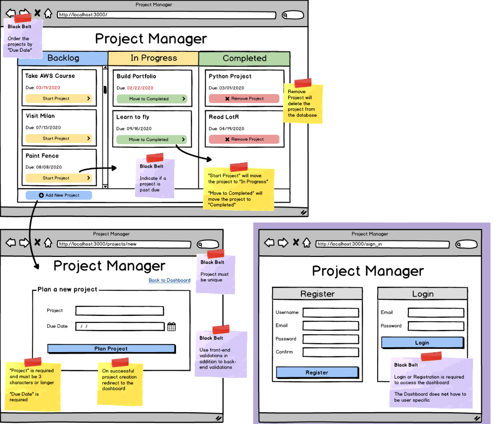

# Project Manager
In this belt exam you will create a kanban board where users can plan and manage projects.

### For a red belt:
- **Dashboard**: Display all of the projects in three columns based on the project status.
- **Dashboard**: The "Start Project" button should set the project's status to "In Progress".
- **Dashboard**: The "Move to Completed" button should set the project's status to "Completed".
- **Dashboard**: The "Remove Project" button should delete the project.
- **Validations**:
  - Project is required and must be 3 characters or longer.
  - Due Date is required.

### For a black belt:
- **Implement 2 of the following**:
  - Login and Registration - the user must login or register to use the rest of the app.
  - Sort the projects by "Due Date".
  - Indicate if the project is past due (due date is earlier than today).
  - Ensure the Project is unique when adding it to the database.
  - Use front-end validations in addition to back-end validations.

### Black Belt Hints:
- **Relative time**: [momentjs.com](https://momentjs.com/)
- **Uniqueness**: [mongoose-unique-validator](https://www.npmjs.com/package/mongoose-unique-validator)

### General Guidelines:
- Do everything the prompts ask for. Ask your instructor if you are not sure.

- All files must be submitted in order to receive a grade. This includes all files required for the project to run as intended and any extra files the course may require. Failure to include all files will result in the exam not being graded, which may result in an automatic fail for the exam attempt.
