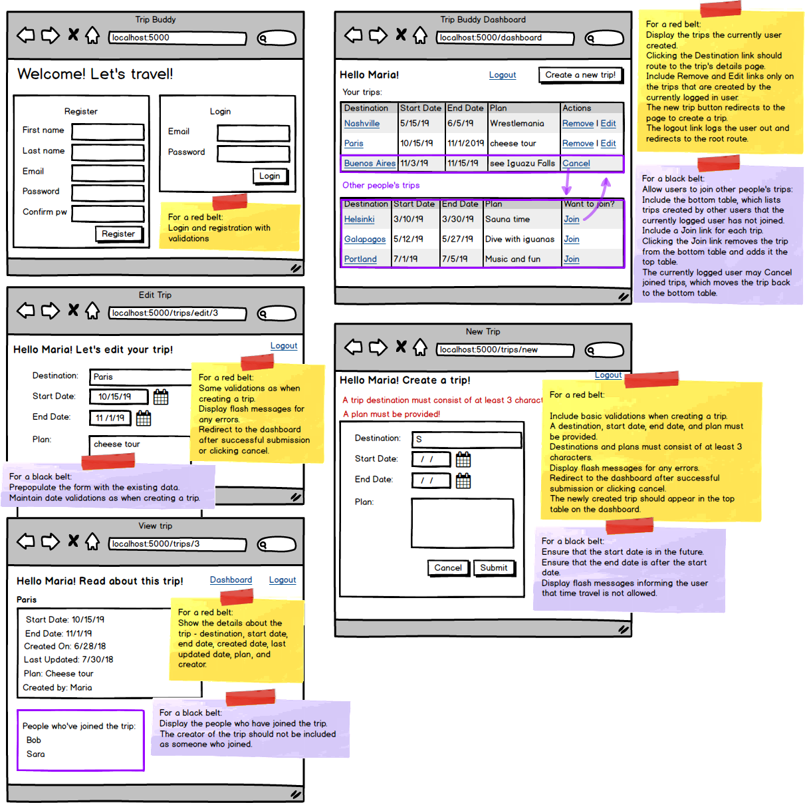

  <h1>✈️Trip Buddy✈️</h1>
  

## Description:

The Trip Management Web Application simplifies trip planning and organization, offering users a centralized platform to create, manage, and join trips. With features for user authentication, personalized dashboards, and intuitive trip creation, the application ensures seamless organization and collaboration. Advanced functionalities like trip joining, creator-exclusive management, and date validations enhance the user experience, while deployment on Amazon EC2 ensures accessibility and reliability.

### For a red belt:

- Login and Registration with validations
- Validation errors should appear on the page
- Logout feature - the user should not be able to enter the app if not logged in
- Dashboard
  - Dashboard should say "Hello {{user}}"
  - Display all the trips the logged user made
  - Clicking the destination of a trip should route to the details page
  - Clicking the remove link deletes the trip from the database
  - Clicking the edit link should route to the edit page
- Create a trip
  - Validations for empty input fields
  - Minimum length of three characters for the destination and plan
  - Display errors with flash messages
  - Redirect back to the dashboard after making a trip or clicking the cancel button
- Edit a trip
  - Same validations apply as when creating a trip
  - Redirect back to the dashboard after editing
  - The dashboard should show the changes made to the trip
- Trip details
  - Display the start date, end date, created date, last updated date, destination, plan, and creator for the trip
  - HTML and CSS reflect the wireframe to at least 75% accuracy

### For a black belt:

- Deploy your work to Amazon EC2 and provide the IP address or subdomain/domain name to where your work has been deployed (Heroku deployment not honored)
- Include the bottom table on the dashboard for joined trips
- A user may join trips that other users created
- The newly made trip should appear in the top table on the dashboard
- Only the creator of a trip may remove or edit
- Joining a trip moves the trip from the bottom table to the top table
- Users may cancel a trip they joined, which means they no longer wish to go on the trip and the trip moves back to the bottom table
- Include date validations when creating and editing trips
  - Trips must take place in the future
  - Trips must end after they begin
  - Show flash messages informing the user if they attempt to time travel
- In the trip details, display who is joining the trip
  - Do not include the creator of the trip as someone who joined the trip
- Also:
  - If you are using Flask, include a file with the SQL script to create your database (this can be copied when you forward engineer your ERD)
  - Remove your GitHub repo after deploying.
  - The wireframe is available for download [here](https://assets.codingdojo.com/boomyeah2015/codingdojo/curriculum/content/chapter/pythonTripBuddy2.png).
