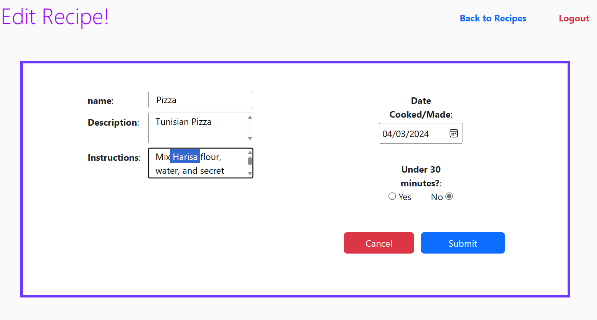

# 🥗<a href="https://login.codingdojo.africa/m/506/12466/87454"> Recipe Share</a>🍲📝

Welcome to My Recipe Management Web Application!</a>

## Introduction

This web application allows users to register, login, view, create, edit, and remove recipes. Users can manage their own recipes but cannot edit or remove recipes created by other users. It provides a convenient way to organize and share recipes with others.

## Features

🔒 **User Authentication**: Users can register for an account and login securely to access their recipes.

📜 **Recipe Management**: Users can view, create, edit, and remove their recipes. Each recipe includes details such as name, description, instructions, and whether it can be made in under 30 minutes.

🔍 **Search Functionality**: Users can search for recipes by name or keywords to quickly find what they're looking for.

## Screenshots

Here are some screenshots of our web application in action:

| Home Page | Recipes List | 
|:---------:|:-----------:|
| <div style="width: 100%; overflow: hidden; border: 5px solid #6c36fc; margin: 0;padding: 0;"></div> | <div style="width: 100%; overflow: hidden; border: 5px solid #6c36fc; margin: 0;padding: 0;"></div>

| Recipe View | Recipe Edit |Recipe Creation |
|:-----------:|:-------------:|:---------------:|
| <div style="width: 100%; overflow: hidden; border: 5px solid #6c36fc; margin: 0;padding: 0;"></div> | <div style="width: 100%; overflow: hidden; border: 5px solid #6c36fc; margin: 0;padding: 0;"></div> | <div style="width: 100%; overflow: hidden; border: 5px solid #6c36fc; margin: 0;padding: 0;"></div>

## Technologies Used

- Python Flask: A lightweight web framework for building web applications.
- HTML/CSS: Frontend technologies for creating the user interface and adding interactivity.
- MySQL DB

## Installation

1. Clone the repository:

    ```bash
    after merging
    ```

2. Install dependencies:

    ```bash
    pip install flask, pymysql, bcrypt
    ```

3. Run the application:

    ```bash
    python server.py
    ```

4. Access the application in your web browser.

## Usage

1. Register for an account if you're a new user, or login if you already have an account.

2. Once logged in, you can view your recipes on the homepage. From here, you can create, edit, or remove recipes as needed.

3. To create a new recipe, click on the "Create Recipe" button and fill in the required details.

4. To edit or remove a recipe, click on the links provided in actions column.

## Contributors

- [Chawki Mbarki](https://github.com/ChawkiMbarki/)

## License

This project is licensed under the MIT License - see the [LICENSE](LICENSE) file for details.
