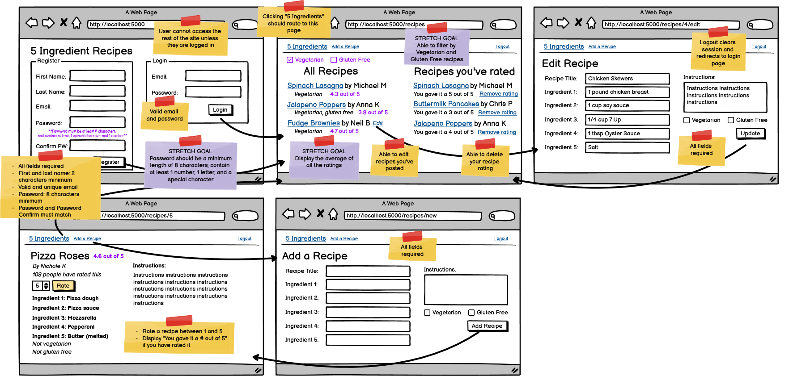
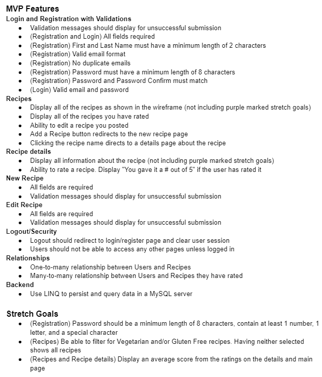

# 5 Ingredient Recipes
In this belt exam you will create a Recipies platform where users can create, manage, and rate recipies.

### General Guidelines:
- Do everything the prompts ask for. Ask your instructor if you are not sure.

- All files must be submitted in order to receive a grade. This includes all files required for the project to run as intended and any extra files the course may require. Failure to include all files will result in the exam not being graded, which may result in an automatic fail for the exam attempt.
