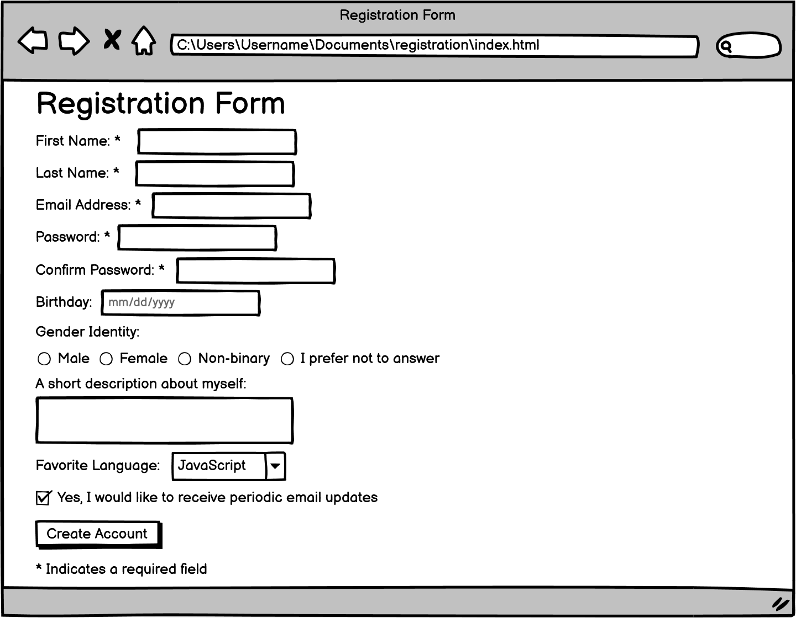

# Registration Form

### Objectives

- Practice recreating the staple of many websites, a Registration Form

- Practice using form, `input`, `select` and `textarea`

Now that we've learned about all of the different types of form tags, let's create a registration form using only HTML. When registering for many websites, whether it's for an email account, a social media platform, or even this bootcamp, you are submitting a form! You will be using lots and lots of forms over the next few months to send data to your back-end so let's get comfortable creating some forms.

Recreate all the HTML elements shown on the image above! As you haven't learned yet how to use CSS to make the form look nice, don't worry about how our registration form looks for now.

Our HTML should contain the following tags:

- <mark>`<input type="text">`</mark> 
- <mark>`<input type="password">`</mark> 
- <mark>`<input type="date">`</mark> 
- <mark>`<input type="radio">`</mark> 
- <mark>`<input type="checkbox">`</mark> 
- <mark>`<input type="submit">`</mark> 
- <mark>`<textarea>`</mark> 
- <mark>`<select>`</mark> 

We'll get to use forms in one way or another in many later assignments during the bootcamp so don't feel the need to memorize all of the different form tags and attributes today. We can always come back to this chapter for reference!

<b>Important</b>: don't worry too much about making the form look identical to the image. We will be learning about how exactly to do that tomorrow. For today, it's good enough that the form has all the inputs it needs.